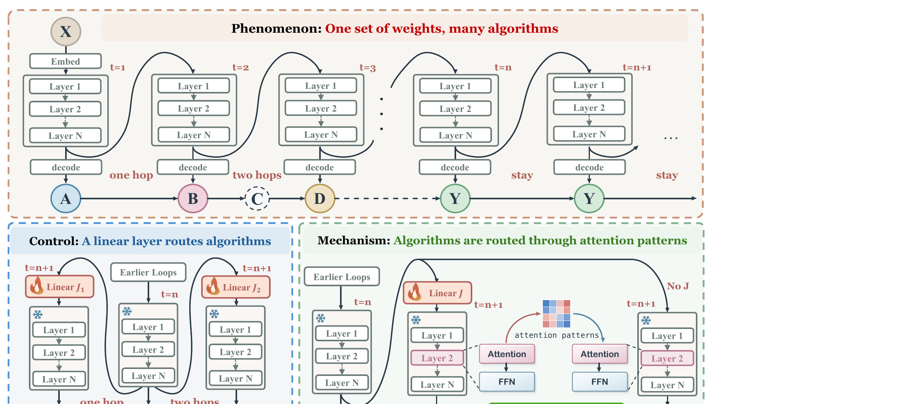

# howloop

[](https://arxiv.org/abs/2609.39892)
[](https://github.com/wjjpku/howloop/actions/workflows/reproduce.yml)
[](LICENSE)

**Code, archived results, and figure reproduction for** [*Shared Weights, Selected Computations: How Looped Transformers Route What Each Loop Does*](https://arxiv.org/abs/2609.39892) by Jiaju Wu, Yi Hu, and Muhan Zhang.

A looped Transformer reuses its weights, but its loops need not perform the same operation. The paper follows three steps: observe variable progress in native graph-walk trajectories; use a learned linear map at the loop boundary to select the next transition of a frozen backbone; and use attention interventions to test how that selection is routed. Matched backbone-training comparisons show how intermediate supervision changes which transitions the map can induce. The repository connects each reported result to its source code, saved evidence, and plotting command.



[Paper PDF](paper/arxiv_v1.pdf) · [Reviewer guide](REVIEWER_GUIDE.md) · [Experiment-to-paper index](docs/EXPERIMENTS.md) · [Reproducibility limits](docs/REPRODUCIBILITY_LIMITS.md)

## Reproduce the published figures and saved results

The archive is pinned to **arXiv:2609.39892v1**: the included [36-page PDF](paper/arxiv_v1.pdf) and [TeX source](paper/main.tex) reference 21 figure assets. Use Python 3.12 on Linux or macOS:

```bash
git clone https://github.com/wjjpku/howloop.git
cd howloop
python3 -m venv .venv
source .venv/bin/activate
python -m pip install -r requirements-plot.txt
python scripts/verify_integrity.py
python reproduce.py
```

For a downloaded ZIP, start at `python3 -m venv .venv` inside the extracted directory. The integrity check validates file hashes and the figure map. `reproduce.py` writes the paper's 21 referenced assets to `outputs/figures/` and audits the saved graph-composition, Qwen, and knowledge-graph predictions. Figure 1 is supplied artwork; the other 20 assets are generated from archived numerical inputs. Locally generated PDF encodings need not be byte-identical to the paper's embedded PDFs.

The remaining saved-result audits are:

```bash
python scripts/audit_results.py
python scripts/audit_parity_phase.py
python experiments/revision/audit_paper_matched.py
python experiments/revision/mechanism_aggregate.py
```

## Find the evidence

| Paper result | Where to start |
| --- | --- |
| Native loop trajectories and target selection | [Graph experiments](experiments/n10/) and [trajectory records](experiments/revision/trajectories/) |
| State steering and controller composition | [Two-step records](experiments/composition/) and [independent Figure 8 confirmation](experiments/revision/arxiv_v1_composition/) |
| Attention routing in graph walk and Ouro | [Graph mechanism](experiments/graph_mechanism/) and [Ouro interventions](experiments/ouro_256_mechanism/) |
| Matched intermediate-supervision comparison | [Five paired runs and audit](experiments/revision/matched/) |
| Depth limits, Parity, and graph continuation | [Long-range results](experiments/long_range/), [Parity](experiments/parity_phase/), and [graph continuation](experiments/graph_continuation/) |
| Appendix H: Qwen3-8B and synthetic KG | [Qwen predictions](experiments/qwen/) and [KG predictions](experiments/kg/) |

The [full experiment index](docs/EXPERIMENTS.md) gives the figure, table, protocol, and code path for each result. [Figure provenance](provenance/figures.json) lists every manuscript asset and its inputs. In particular, arXiv v1's Figure 8 uses **512 additional held-out graphs** and 3,175 retained examples; its five-backbone, two-fit saved predictions and audit are under [`experiments/revision/arxiv_v1_composition/`](experiments/revision/arxiv_v1_composition/).

## Scope of reproduction

The CPU commands recompute figures and statistics from archived predictions. They do **not** repeat training or every GPU forward pass. Large original checkpoints are excluded; their identities are recorded under [`provenance/`](provenance/). [Running original-weight experiments](docs/RUNNING.md) describes the external dependencies, and [reproducibility limits](docs/REPRODUCIBILITY_LIMITS.md) identify what the public archive verifies.

## Cite

Please cite both the [paper](https://arxiv.org/abs/2609.39892) and this repository. GitHub's **Cite this repository** menu reads [CITATION.cff](CITATION.cff).

```bibtex
@misc{wu2026sharedweights,
  title         = {Shared Weights, Selected Computations: How Looped Transformers Route What Each Loop Does},
  author        = {Jiaju Wu and Yi Hu and Muhan Zhang},
  year          = {2026},
  eprint        = {2609.39892},
  archivePrefix = {arXiv},
  primaryClass  = {cs.LG},
  url           = {https://arxiv.org/abs/2609.39892}
}
```

Repository-authored code and documentation use the [MIT license](LICENSE). The manuscript and third-party components retain their respective terms; see [NOTICE.md](NOTICE.md). The exact arXiv source and PDF hashes are in [the paper manifest](provenance/arxiv_v1_manifest.json).
